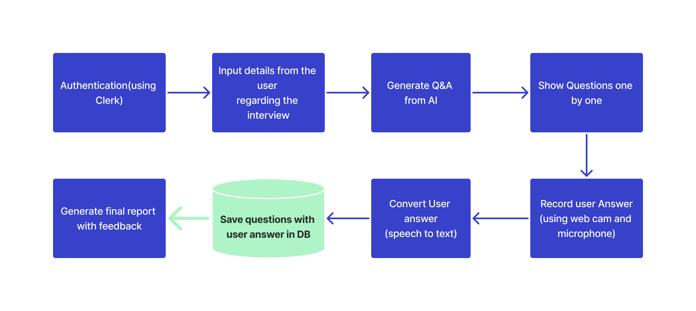

# Mockify - AI-Based Mock Interviewer  

Mockify is an AI-powered mock interview platform that helps job seekers practice technical and behavioral interviews in a simulated environment. The platform provides real-time feedback and generates an evaluation report based on user responses.  

## 🚀 Features  
- 🎙️ **AI-Powered Mock Interviews** – Get a realistic interview experience.  
- 📹 **Webcam & Microphone Support** – Practice with real-time video/audio input.  
- 📊 **Automated Evaluation** – Receive feedback on your answers.  
- 💾 **Secure & Private** – No video recordings; your data remains safe.  

## 🛠️ Tech Stack  
- **Frontend:** Next.js, React, Tailwind CSS, ShadCn UI 
- **Backend:** Drizzle ORM, Neon Database  
- **AI Processing:** Gemini API  
- **Authentication:** Clerk

## 📸 Screenshots  
Coming soon...  

## ⚙️ Workflow


## 🔧 Installation & Setup  
```sh
git clone https://github.com/bhargav1131/mockify.git  
cd mockify  
npm install  
npm run dev 
``` 

## 🤝 Contributing
Contributions are welcome! Feel free to submit issues and pull requests.

---

*Developed with ❤️ by Bhargav Pratim Sharma*
